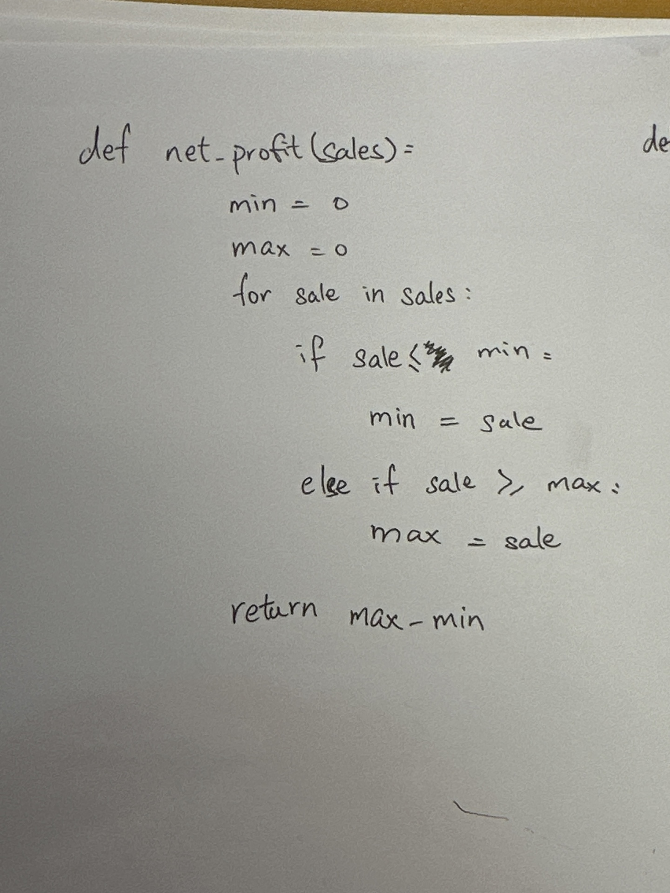

# Quiz 069

## Prompt
One array holds the daily sales of a clothing store in no particular order. You are tasked with finding the profit of the best day in comparison to the worst day. That is, how much more was sold in Japanese Yens the best day?
## Code Structure

*Fig.1* **Image showing output of program**
