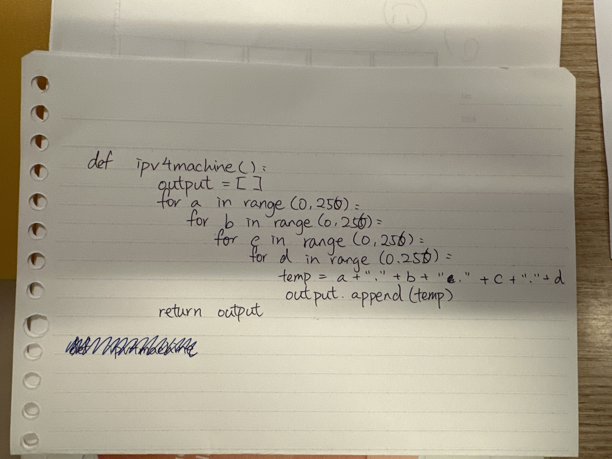

# Quiz 070

## Prompt
Create the code for the IPv4 machine
## Code Structure

### Python File
```python
#2023-03-07 Quiz 070
def ipv4machine_bernard():
    output = []
    for a in range(0,256):
        for b in range(0,256):
            for c in range(0,256):
                for d in range(0,256):
                    output.append(f"{a}.{b}.{c}.{d}")
    return output
```

### Paper Programming

