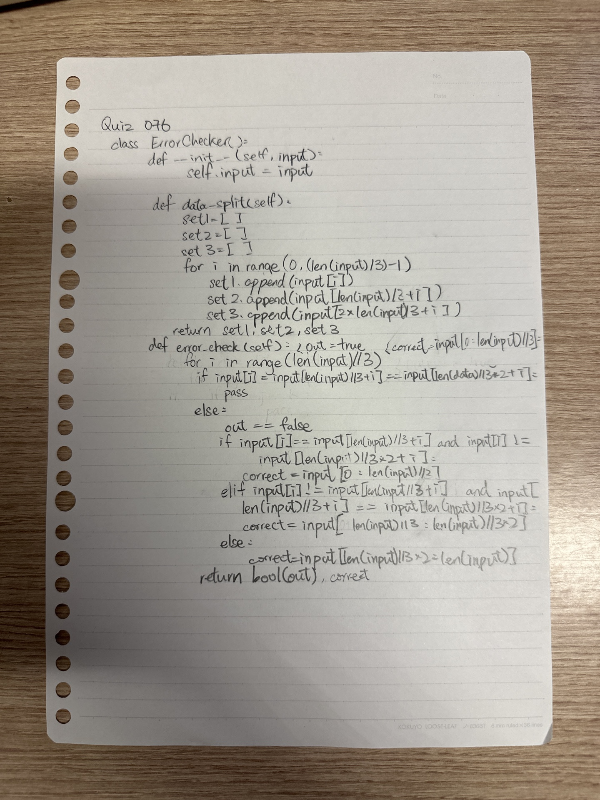
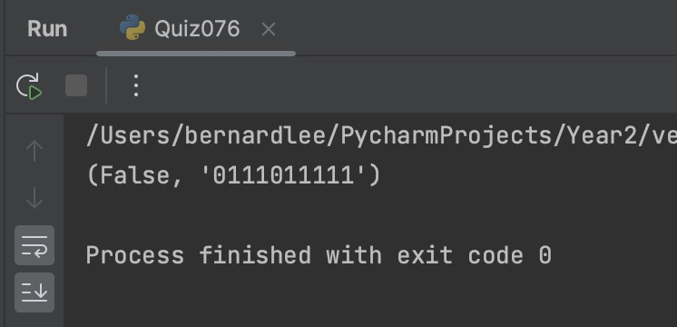

# Quiz 076

## Prompt
Create the function.

## Code Structure

### Python File
```python
class ErrorChecker():
    def __init__(self, input:str):
        self.input = input

    def error_check(self):
        out = True
        correct = ""
        for i in range(len(self.input)//3):
            length = int(len(self.input)//3)
            if self.input[i] == self.input[i+length] == self.input[i+2*length]:
                correct += self.input[i]
                pass
            else:
                out = False
                if self.input[i] == self.input[i+length] or self.input[i] == self.input[i+2*length]:
                    correct += self.input[i]
                elif self.input[i+length] == self.input[i+2*length]:
                    correct += input[i+length]
        return out, correct

    def error_check_v2(self):
        length = len(self.input) // 3
        correct = []

        for i in range(length):
            a = int(self.input[i])
            b = int(self.input[i + length])
            c = int(self.input[i + 2 * length])

            correct.append('1' if sum([a, b, c]) > 1 else '0')

        return ''.join(correct)

data = "011101111101110111110111001111"
boi = ErrorChecker(data)
print(boi.error_check())
```

### Paper Programming

*Fig.1* **Proof of Paper Programming**


### Evidence

*Fig.2* **Image showing output of program**
