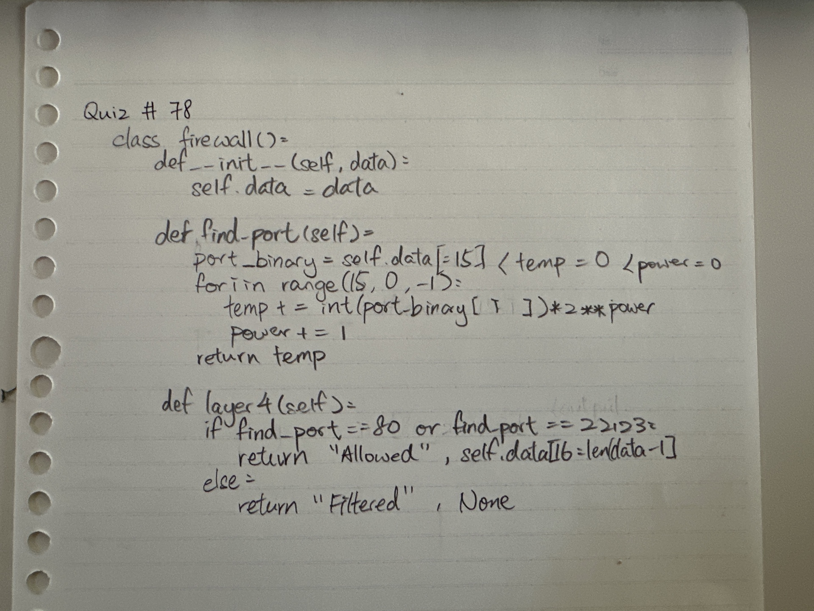
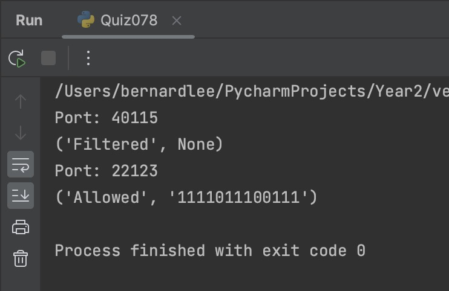

# Quiz 078

## Prompt
The layer in the OSI model that adds the port number to the header is the Transport Layer, which is Layer 4 in the OSI model. Create a Layer 4 firewall which only allows connections in **Port 80 and 22123**. Assume the first 16 bits of the input string are used for the port number.
## Code Structure

### Python File
```python
#2023-09-18 Quiz 078
#Layer 4 Firewall

class firewall():
    def __init__(self, data:str):
        self.data = data

    def find_port(self):
        temp = 0
        power = 0
        for i in range(15,-1,-1):
            temp += int(self.data[i])*2**power
            power += 1
        return temp

    def layer4(self):
        print(f"Port: {self.find_port()}")
        if self.find_port()==80 or self.find_port()==22123:
            return "Allowed" , self.data[16:len(self.data)-1]
        return "Filtered", None

boi = firewall("100111001011001110010110011100101")
print(boi.layer4())

boi2 = firewall("010101100110101111110111001111")
print(boi2.layer4())
```

### Paper Programming


### Evidence
