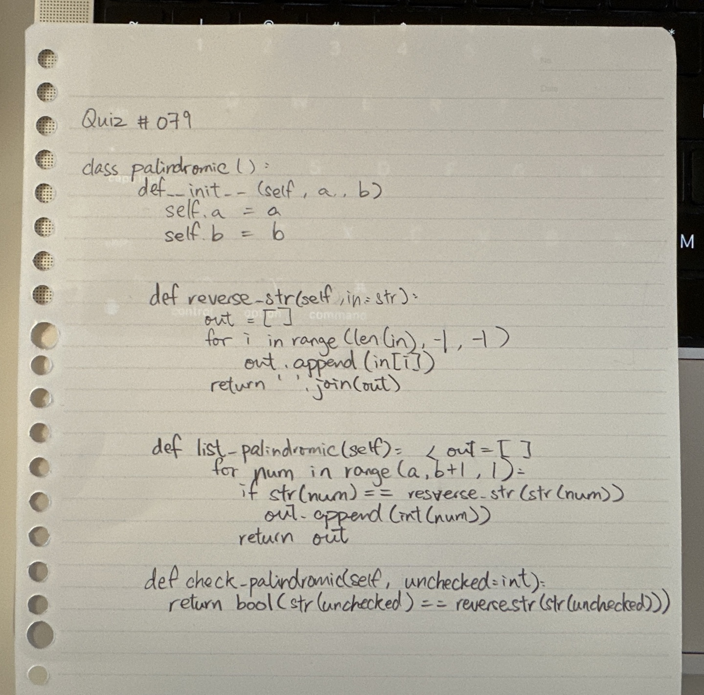
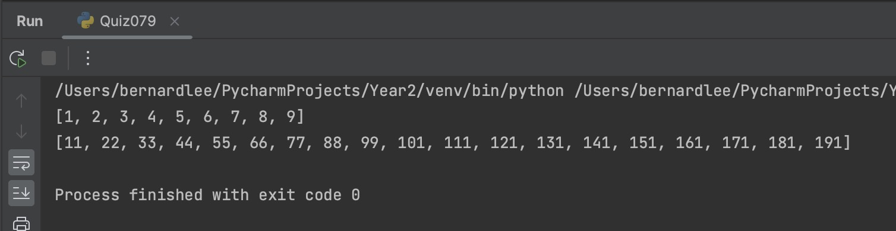

# Quiz 078

## Prompt
Create the class for a palindromic checker
## Code Structure

### Python File
```python
#2023-09-15 Quiz 079
#Palindromic Numbers Checker

class palindromic():
    def __init__(self,a,b):
        self.a = a
        self.b = b

    def reverse_str(self, original:str):
        out = []
        for i in range(len(original)-1, -1, -1):
            out.append(original[i])
        return "".join(out)

    def list_palindromic(self):
        out = []
        for num in range(self.a,self.b+1,1):
            if str(num) == self.reverse_str(str(num)):
                out.append(int(num))
        return out

    def check_palindromic(self,unchecked:int):
        return bool(str(unchecked) == self.reverse_str(str(unchecked)))


boi = palindromic(1,9)
boi2 = palindromic(10,199)

print(boi.list_palindromic())
print(boi2.list_palindromic())
```

### Paper Programming

*Fig.1* **Proof of Paper Programming**


### Evidence

*Fig.2* **Image showing output of program**
