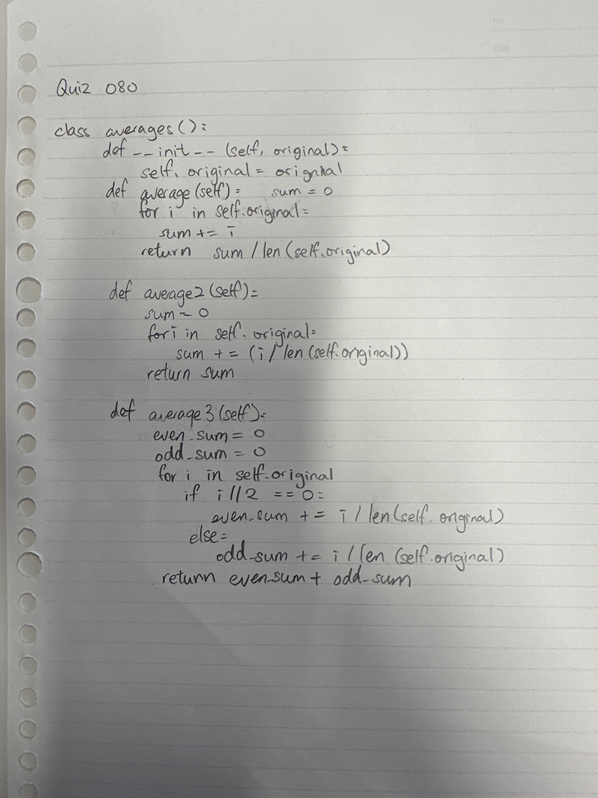
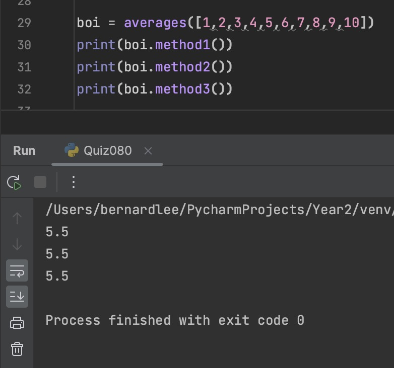

# Quiz 080

## Prompt
Create the class for a different ways to get averages
## Code Structure

### Python File
```python
#2023-09-19 Quiz080

class averages():
    def __init__(self, a):
        self.a = a
    def method1(self):
        sum = 0
        for i in self.a:
            sum += i
        return sum/len(self.a)

    def method2(self):
        sum = 0
        for i in self.a:
            sum += i / len(self.a)
        return sum

    def method3(self):
        even = 0
        odd = 0
        for i in self.a:
            if i % 2 == 0:
                even += i / len(self.a)
            else:
                odd += i /  len(self.a)
        return even + odd


boi = averages([1,2,3,4,5,6,7,8,9,10])
print(boi.method1())
print(boi.method2())
print(boi.method3())
```

### Paper Programming

*Fig.1* **Proof of Paper Programming**


### Evidence

*Fig.2* **Image showing output of program**
