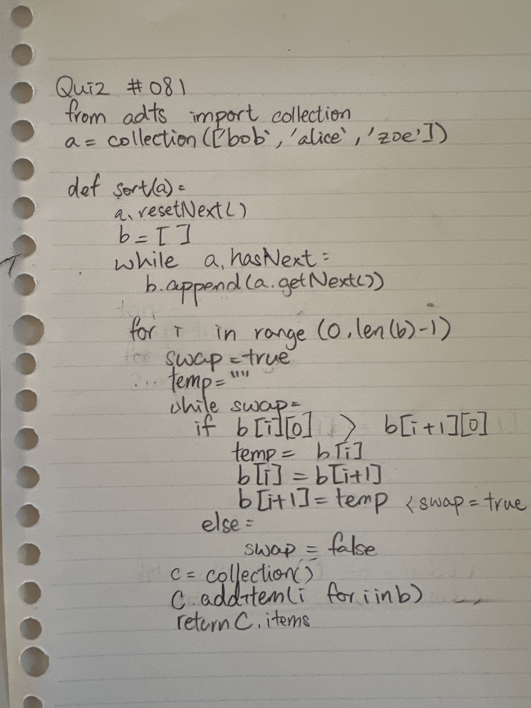
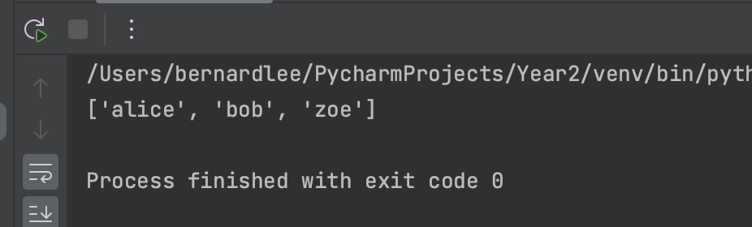

# Quiz 081

## Prompt
Create a function to sort a collection
## Code Structure

### Python File
```python
import Lessons.Collections

a = Lessons.Collections.collection(["bob","alice","zoe"])

def sort(a):
    a.resetNext()
    b = []
    while a.hasNext():
        b.append(a.getNext())
    for i in range(len(b)-1):
        swap = True
        temp = ""
        while swap:
            if b[i][0] > b[i+1][0]:
                temp = b[i]
                b[i] = b[i+1]
                b[i+1] = temp
                swap = True
            else:
                swap = False
    c = Lessons.Collections.collection()
    for i in range(len(b)):
        c.addItem(b[i])
    return c


print(sort(a).items)
```

### Paper Programming

*Fig.1* **Proof of Paper Programming**


### Evidence

*Fig.2* **Image showing output of program**
