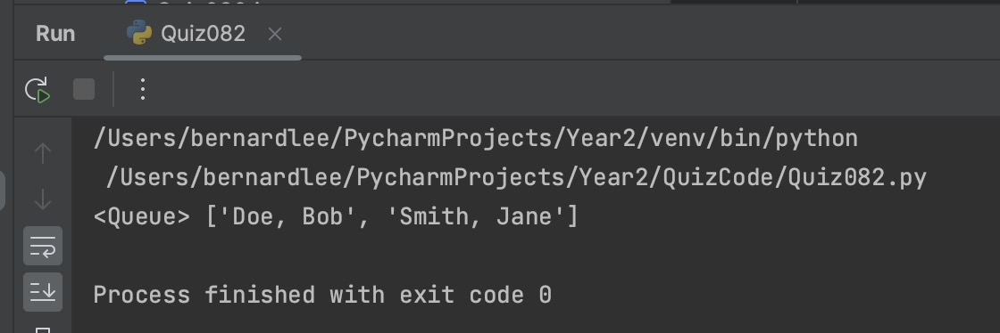

# Quiz 082

## Prompt
Create a function to sort a queue
## Code Structure

### Python File
```python
#2023-09-22 Quiz 082
import Lessons.adts
x = Lessons.adts.queue()
x.enqueue("Smith, Jane")
x.enqueue("Doe, Bob")
y = []
def sort_queue():
    while not x.isEmpty():
        temp2 = x.dequeue()
        y.append(temp2)
    for i in range(len(y)):
        for j in range(0, len(y) - i - 1):
            if y[j] > y[j + 1]:
                y[j], y[j + 1] = y[j + 1], y[j]
    for i in range(len(y)):
        x.enqueue(y[i])
    return x

print(sort_queue())
```

### Paper Programming

*Fig.1* **Proof of Paper Programming**


### Evidence

*Fig.2* **Image showing output of program**
