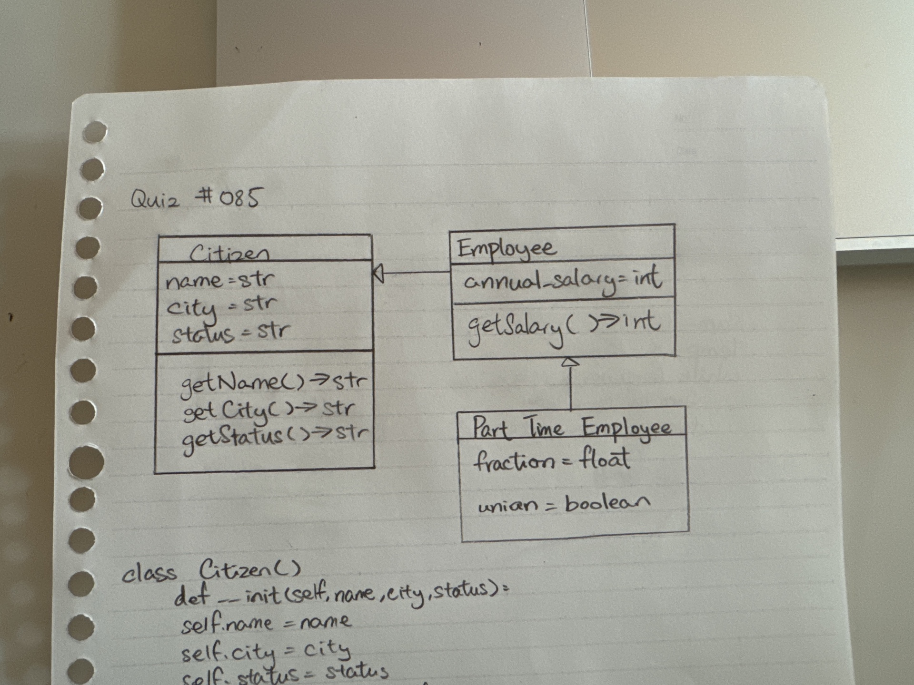

# Quiz 084

## Prompt
Draw the UML Diagram

## Code Structure
```python
class Citizen():
    def __init__(self, name: str, city: str, status: str):
        self.name = name
        self.city = city
        self.status = status

    def getName(self): return self.name

    def getCity(self): return self.city

    def getStatus(self): return self.status


class Employee(Citizen):
    def __init__(self, name: str, city: str, status: str, annual_salary: int):
        self.annual_salary = annual_salary
        Citizen.__init__(self, name, city, status)

    def getSalary(self): return self.annual_salary


class PartTimeEmployee(Employee):
    def __init__(self, name: str, city: str, status: str, annual_salary: int, fraction: float, union: bool):
        self.fraction = fraction
        self.union = union
        Employee.__init__(self, name, city, status, annual_salary)


a = Citizen("Bob","Tokyo","Alive")
b = Employee("Alice","Kyoto","Alive",100000)
c = PartTimeEmployee("Joe","Nagano","Alive",100000,0.5,False)
```

## Paper Programming

*Fig.1* **Proof of Paper Programming**