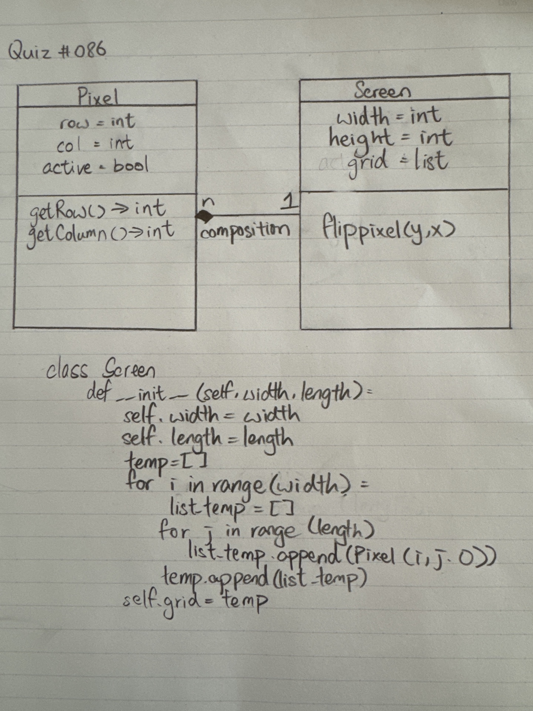

# Quiz 086

## Prompt
Draw the UML Diagram and code the constructor for the class below.

## Code Structure
```python
class Pixel():
    def __init__(self,row:int,col:int,active:bool):
        self.row = row
        self.col = col
        self.active = active

    def getRow(self):return self.row
    def getCol(self):return self.col

    def __repr__(self):
        return str("■" if self.active else "□")


class Screen():
    def __init__(self,width:int,height:int):
        self.width = width
        self.height = height
        temp = []
        for i in range(height):
            temp.append([])
            for j in range(width):
                temp[i].append(Pixel(i,j,False))
        self.grid = temp

    def flipPixel(self,y:int,x:int):
        self.grid[y][x].active = not self.grid[y][x].active
        return

    def __repr__(self):
        temp = ""
        for i in range(self.height):
            for j in range(self.width):
                temp += str(self.grid[i][j])
            temp += "\n"
        return temp
```

## Paper Programming

*Fig.1* **Proof of Paper Programming**