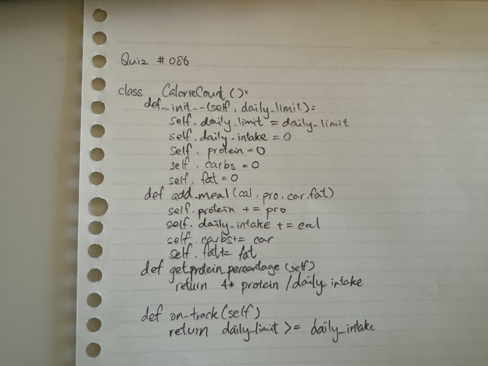

# Quiz 087

## Prompt
Code the class to fit the test results

## Code Structure
```python
class CalorieCount():
    def __init__(self,daily_limit):
        self.daily_limit = daily_limit
        self.daily_intake = 0
        self.protein = 0
        self.carbs = 0
        self.fat = 0

    def add_meal(self,cal,pro,carb,fat):
        self.protein += pro
        self.daily_intake+=cal
        self.carbs+=carb
        self.fat=fat

    def get_protein_percentage(self):
        return round(4*self.protein/self.daily_intake,2)

    def on_track(self):
        return self.daily_limit>=self.daily_intake

sunday = CalorieCount(1500)

sunday.add_meal(716,38,38,45)
sunday.add_meal(230,16,8,16)
sunday.add_meal(568,38,50,24)

print(sunday.on_track())
print(sunday.get_protein_percentage())
```

## Paper Programming

*Fig.1* **Proof of Paper Programming**