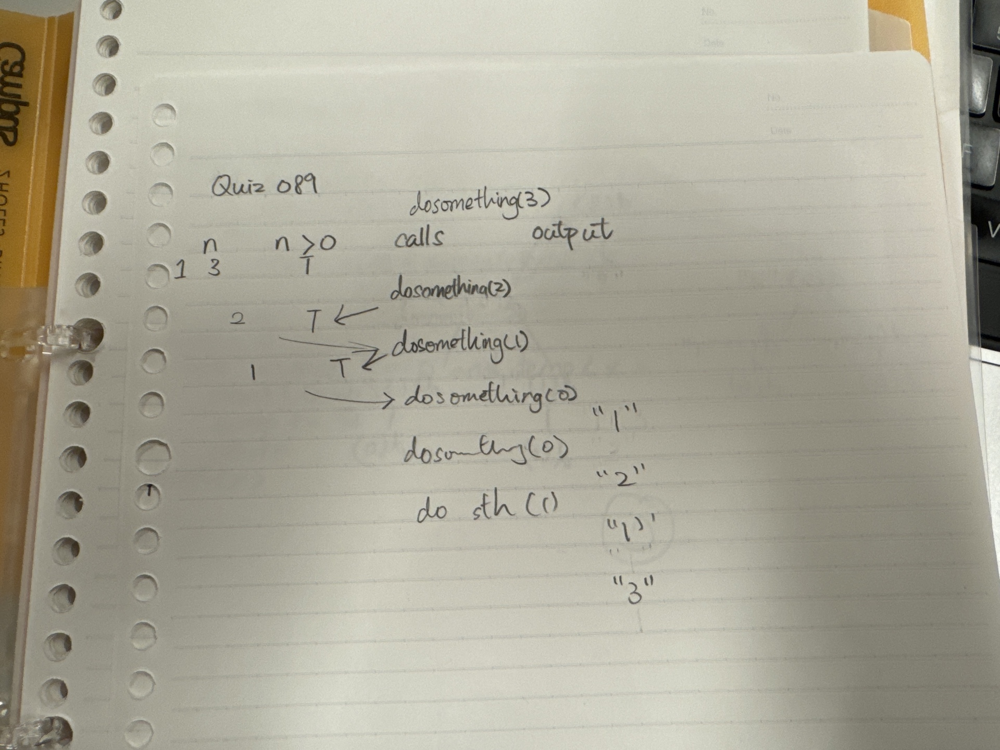
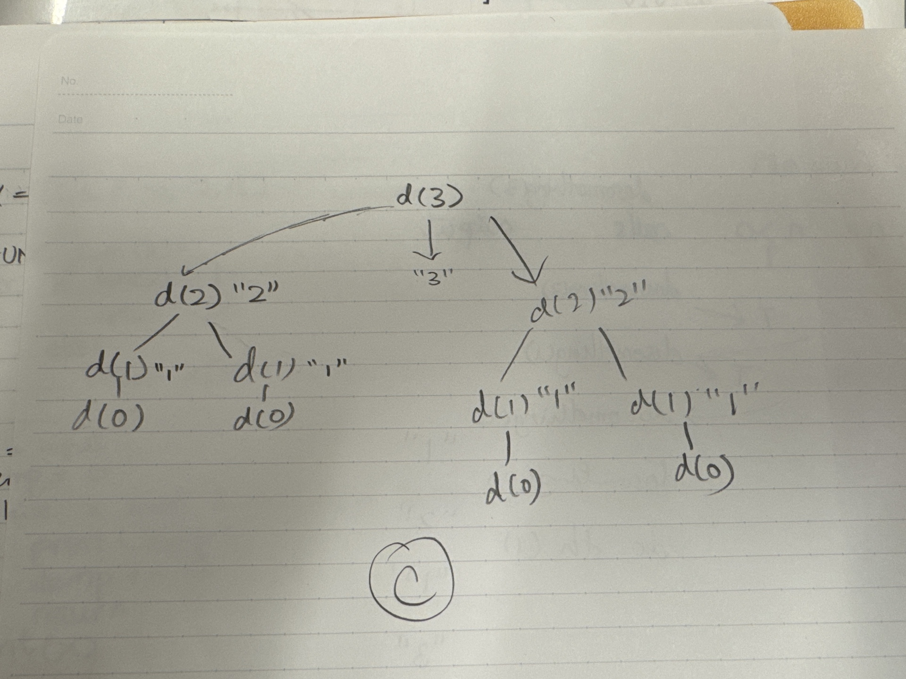

# Quiz 090

## Prompt
Trace the function

## Python Code
```python
def doSomething(n):
    if n>0:
        doSomething(n-1)
        print(n)
        doSomething(n-1)
        
doSomething(3)
```


## Answer
1213121

## Paper Programming

