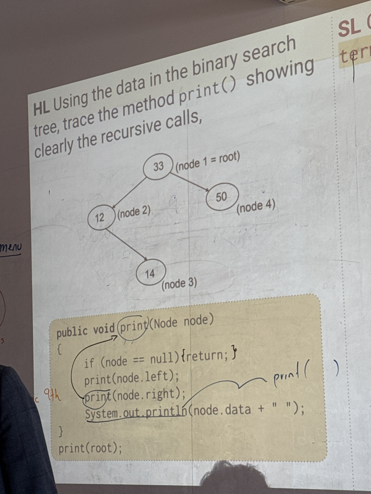
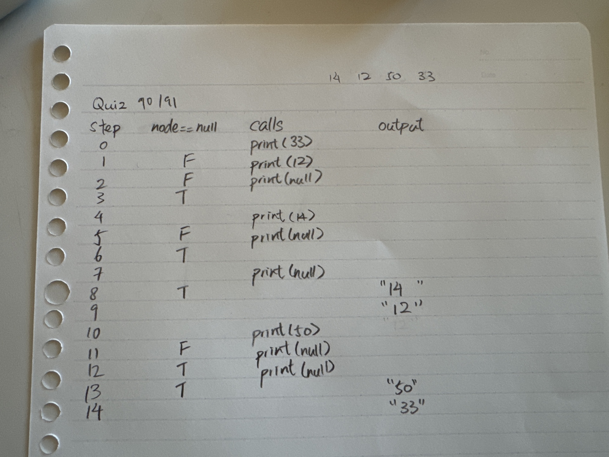

# Quiz 091

## Prompt
Trace the function


## Python Main Code
```python
import sys

sys.path.append('../Year2')

from Lessons import adts

x = adts.binaryTree(33)
x.addNode(50)
x.addNode(12)
x.addNode(14)

def print_yay(x):
    if x == None:
        return
    print_yay(x.left)
    print_yay(x.right)
    print(x.data)

print_yay(x)
```

## Python ADTS
```python
class binaryTree():
    def __init__(self, data):
        self.data = data
        self.left = None
        self.right = None

    def addNode(self, data):
        if data < self.data:
            if self.left:
                self.left.addNode(data)
            else:
                self.left = binaryTree(data)
        else:
            if self.right:
                self.right.addNode(data)
            else:
                self.right = binaryTree(data)

    def __repr__(self):
        return f"{self.data}"

    def __str__(self):
        return f"{self.data}"

    def printTree(self):
        if self.left:
            self.left.printTree()
        print(self.data)
        if self.right:
            self.right.printTree()
```


## Answer
14 12 50 33

## Paper Programming
