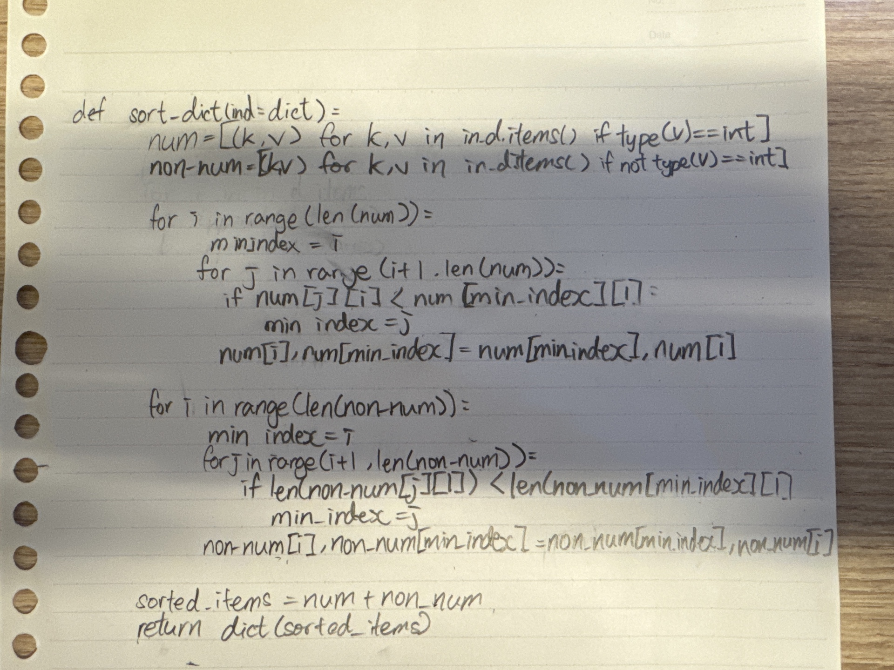

# Quiz 094

## Python Code
```python
#2023-11-24 Quiz094
def sorted_dict(input_dict:dict):
    num = [(k,v) for k ,v in input_dict.items() if type(v) == int]
    non_num = [(k,v) for k ,v in input_dict.items() if type(v) != int]

    for i in range(len(num)):
        min_index = i
        for j in range(i+1, len(num)):
            if num[min_index][1] > num[j][1]:
                min_index = j
        num[i], num[min_index] = num[min_index], num[i]

    for i in range(len(non_num)):
        min_index = i
        for j in range(i+1, len(non_num)):
            if len(non_num[min_index][1]) > len(non_num[j][1]):
                min_index = j
        non_num[i], non_num[min_index] = non_num[min_index], non_num[i]

    return dict(num + non_num)

a = {'apple':'red','banana':2,'orange':'orange','grape' : 1,  'kiwi':'brown', 'pear':8}

print(sorted_dict(a))
```

## Output
```python
{'grape': 1, 'banana': 2, 'pear': 8, 'apple': 'red', 'kiwi': 'brown', 'orange': 'orange'}
```

## Paper Programming
