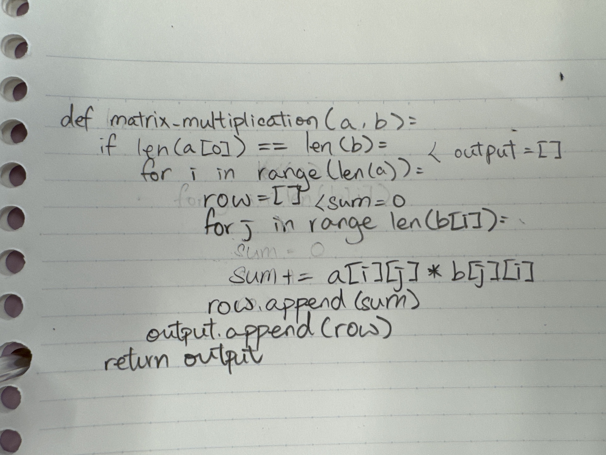

# Quiz 096

## Python Code
```python
def matrix_multiply(A, B):
    # Check if number of columns in A is equal to number of rows in B
    if len(A[0]) != len(B):
        return None
    else:
        # Initialize the output matrix
        output = []
        for i in range(len(A)):
            # Initialize the row for output matrix
            row = []
            for j in range(len(B[0])):
                # Calculate each element of the output matrix
                sum = 0
                for k in range(len(B)):
                    sum += A[i][k] * B[k][j]
                row.append(sum)
            output.append(row)
        return output


A = [[1, 2], [3, 4]]
B = [[2, 0], [1, 2]]

print(matrix_multiply(A, B))
```

## Paper Programming
